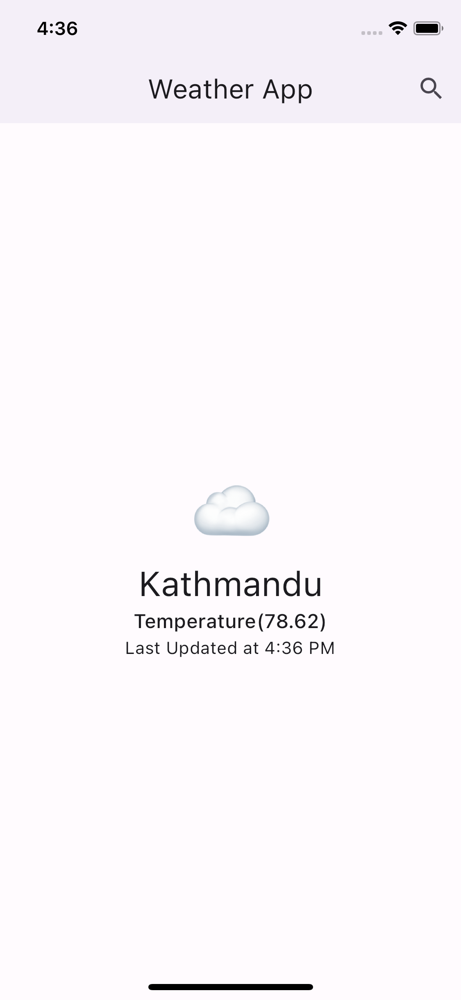

### simple weather app using flutter_bloc and repository(internal package) pattern

in this implementation data layer is separed to separate internal package `open_meteo_api` and domain related stuff is placed inside the `weather_repository` and the main app will call the functions defined inside the domain layer.

